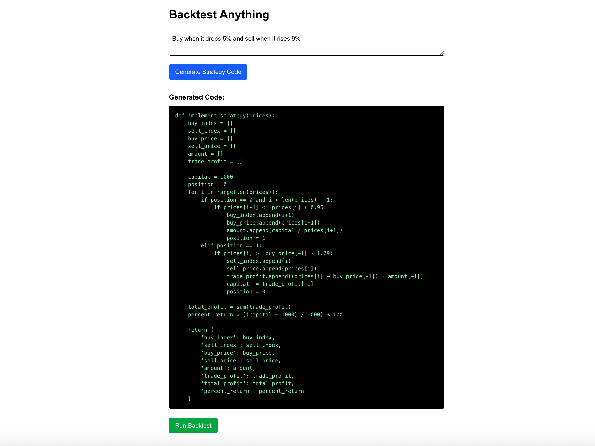

# Backtest Anything

Backtest Anything is a full-stack application that enables users to input plain-English trading strategies and receive Python code that can be backtested on historical Bitcoin data. The app visualizes buy/sell signals and calculates realistic profit and return metrics.

## Features

- Translate natural-language strategies into valid Python trading logic using OpenAI GPT-3.5
- Automatically backtest on BTC historical data (2013–2024)
- View realistic trade signals, profit calculations, and return percentages
- No future price look-ahead — ensures realistic strategy evaluation

## Tech Stack

- **Frontend:** Next.js 14+, TypeScript, Tailwind CSS, Recharts
- **Backend:** FastAPI (Python), Pandas, OpenAI API
- **Data:** CSV file of Bitcoin historical prices
- **Hosting-ready:** Structured for deployment on Vercel (frontend) + Render or Railway (backend)

## Screenshot



## Getting Started

### Prerequisites

- Node.js (v18+)
- Python 3.8+
- OpenAI API key

### Installation

#### 1. Clone the repository

```bash
git clone https://github.com/TobyKThurston/backtest-anything.git
cd backtest-anything
```

#### 2. Set up the backend

```bash
cd backend
python -m venv venv
source venv/bin/activate
pip install -r requirements.txt
```

Create a `.env` file inside the `backend` folder:

```
OPENAI_API_KEY=your_openai_api_key_here
```

Then run the FastAPI server:

```bash
uvicorn main:app --reload
```

#### 3. Set up the frontend

```bash
cd ../frontend
npm install
npm run dev
```

Visit `http://localhost:3000` to use the app.

## Folder Structure

```
backtest-anything/
├── backend/             # FastAPI backend with OpenAI integration
│   ├── main.py
│   ├── btc.csv
│   └── .env
├── frontend/            # Next.js frontend app
│   ├── app/
│   └── components/
├── README.md
└── image.png
```

## Motivation

I wanted to build a project that combined AI, financial data, and real-world applications. Backtest Anything allows anyone to prototype and test algorithmic trading strategies with zero coding experience, and helped me deepen my experience in full-stack development and GPT-powered tools.


